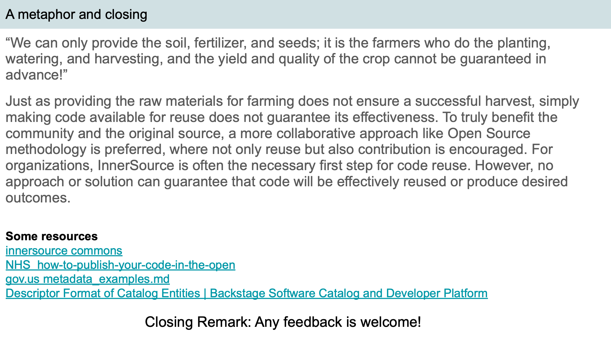

# x-Gov Open Source Community Meeting Notes

## Overview

Notes from the monthly x-Gov open source community meet ups.

To find out details of the meet ups see the [#open-code x-gov slack channel](https://ukgovernmentdigital.slack.com/archives/C0Q3KG7B8).

## 19 May 2023

### Code reuse - Open/Inner Source Presentation

Presenter: [Soydaner](https://github.com/soydaner)

## 12 Apr 2023

### Case study
- Presentation around GCHQ's open source approach
- 1st project went out 7/8 years ago
- trying to follow TCoP and get more eyes on the development that we do
- we want to demonstrate to our people that we can work out of the shadows
- currently quite an involved process to get an organisational GitHub account
- before releasing code open source we have to speak to patent teams, in case there is valuable IP
- also the press office need briefing in case the public raise questions
- we follow a checklist for all new projects similar to the NHS one
  - PII / classification scrub
  - Static Analysis and Vulnerability dependency check (& future plan)
  - Independent review
- GCHQ does not take part in the GDS / CDDO service assessment, but have internal assessment processes
- Have built an internal portal where people can see issues with projects and pick them up and work on them
- Are working to automate the sign-up process for the GCHQ org on GitHub
 
### Changing culture for inner source
- sharing code inside of a dept.
- building confidence on allowing other teams to work on each other's code so avoiding to have to raise tickets on backlogs that never get looked at
- requires confidence in your automation

### Tooling
- tooling for API catalogues [Kong](https://konghq.com/)
- [Backstage](https://backstage.io/) framework for building service catalogues

### Challenges
- Forcing everything to be open is too restrictive
  - As required by the [Service Manual - GOV.UK (www.gov.uk)](https://www.gov.uk/service-manual)
  - we should have a more orderly process to decide what to make open
  - "everything is open" is not very constructive
- Working with GitLab vs GitHub, how can you pull things in?
- Open source review panel: How do you scale this sort of process up?
 
### Next Meeting
- Try to get someone from CDDO to talk about the open source point of the service standard
- Conversations around inner source
- Call for case studies on how other teams are doing open source in their depts.

## 03 Mar 2023

Inaugural meeting of the x-gov open source community.

Meeting notes:

### Starting out in the open
- use commit scanning to catch things locally before being pushed into public repos

### Going from closed to open
- Separate out data and info from source code
- Mirroring closed GitLab main repo into a public GitHub repo
  - Binned the history of the repo

### Challenges

- effort needed to put pipelines and process in place to go from private repo to public repo
- a process for when things go wrong, for example:
  - revoke and rotate leaked keys immediately
- trade off between time and effort spent on this rather than new features
- if urgent bugs are identified in public code do you have the resource to fix the bugs?
- how to build a community to support and maintain the code?
- no-one has ever PR'd into our repo

### Reasons to do open source
- promote best practice as there is nowhere to hide
- less likely to take shortcuts as the code is there for everyone to see
- knowledge transfer: teams and people change

 
 